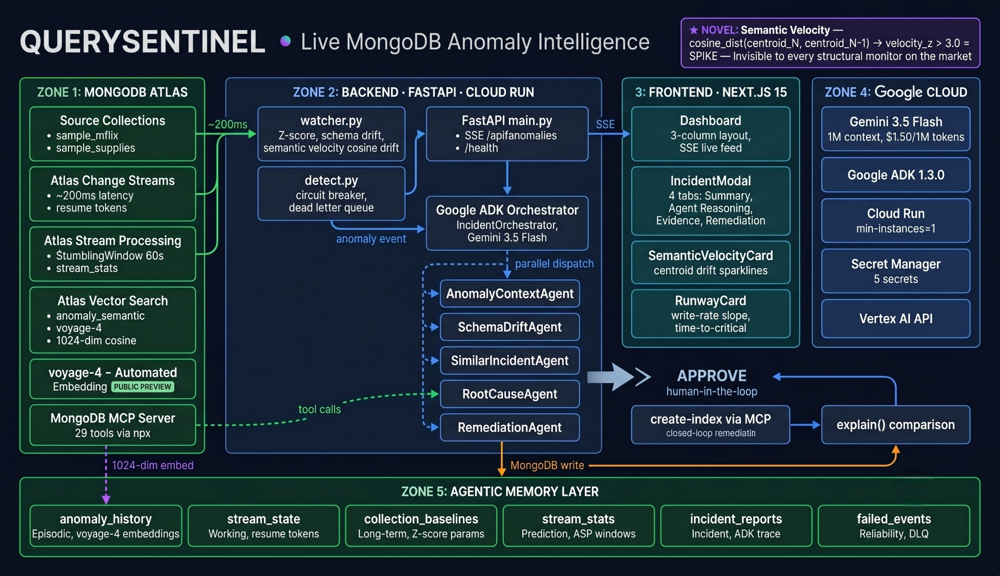

# QUERYSENTINEL

**Securing the AI memory layer — built with Google Gemini + the MongoDB MCP server on MongoDB Atlas**

> *Google Cloud Rapid Agent Hackathon 2026 · MongoDB Track*

> *The first system to detect AI Memory Poisoning and semantic drift at the database layer — 6 Gemini agents investigating live MongoDB anomalies through MongoDB's official MCP server.*

[](LICENSE)
[](https://ai.google.dev/)
[](https://google.github.io/adk-docs/)
[](https://www.mongodb.com/)
[](https://www.mongodb.com/atlas)
[](https://www.python.org/)

**Built with:** Google **Gemini** (via Google ADK) · **MongoDB Atlas** — Change Streams, Vector Search, Stream Processing, and the official **MongoDB MCP server** (29 tools).

---

## The Problem

MongoDB production databases fail silently. A document size explodes. A schema drifts. A semantic category shifts. By the time your monitoring dashboard turns red, the damage — replication lag, query degradation, revenue loss — has already propagated.

Existing solutions tell you *that* something broke. QUERYSENTINEL tells you *what*, *why*, and *exactly how to fix it* — in under two seconds.

---

## What Makes This Different

### The Inversion

Every prior monitoring tool monitors *query performance*. QUERYSENTINEL monitors *data itself* — the shape, size, meaning, and evolutionary trajectory of every document as it enters MongoDB via Change Streams.

### The Novel Detection: Semantic Velocity

**The first to do this at the database layer** — inline on Change Streams, with zero embedding infrastructure (Atlas handles the vectors).

Standard monitoring detects structural anomalies (field added, type changed). QUERYSENTINEL also measures the *semantic distance* between consecutive hourly embedding centroids using voyage-4 Automated Embedding:

```
cosine_distance(centroid_hour_N, centroid_hour_N-1) → semantic_velocity
```

A baseline velocity of 0.04 is normal content variation. A velocity of 0.34 means your data's *meaning* has fundamentally changed — spam injection, model mismatch, category shift — invisible to every structural monitor on the market.

This is built entirely on Atlas. Zero lines of embedding code. Zero separate vector model infrastructure.

---

## Architecture



```
Atlas Change Stream ──→ Watcher (PyMongo) ──→ Google ADK Pipeline
         │                     │                       │
         │              [Persist Resume Token]   [5-agent pipeline · MCP-sequential default]
         │              [Circuit Breaker]        ├── AnomalyContextAgent
         │              [Dead Letter Queue]      ├── SchemaDriftAgent
         ▼                                       ├── SimilarIncidentAgent (voyage-4)
   ASP Stream Processing                         ├── RootCauseAgent (PA)
   $tumblingWindow 60s                           └── RemediationAgent
         │                                               │
         ▼                                         [APPROVE Gate]
   stream_stats ──→ Runway Prediction              │
                                              MCP create-index
```

### MongoDB as the Agentic Memory Layer

MongoDB is not a passive log store in QUERYSENTINEL. It is the **complete memory architecture** for the multi-agent system:

| Memory Type | MongoDB Collection | Purpose |
|-------------|-------------------|---------|
| **Episodic Memory** | `anomaly_history` | voyage-4 auto-embedded past incidents — agents retrieve similar resolutions via $vectorSearch |
| **Working Memory** | `stream_state` | Resume tokens — fast Change Stream recovery on restart |
| **Long-term Memory** | `collection_baselines` | Computed P50/P95/P99 stats — agents compare new events against learned norms |
| **Schema Memory** | `schema_snapshots` | Historical field-type profiles — SchemaDriftAgent detects structural evolution |
| **Output Store** | `incident_reports` | Full ADK pipeline output — human review + APPROVE gate |

This is the architecture Richmond Alake described at AI Engineer World's Fair 2025: MongoDB as *"the memory, state, and coordination layer for agentic systems"* — not just a place to dump logs.

---

## Atlas Features Used

| Feature | How Used |
|---------|----------|
| **Atlas Change Streams** | Core event trigger — every write to monitored collections fires the ADK pipeline within 200ms |
| **Atlas Stream Processing** | `$tumblingWindow` 60s → `$merge` into `stream_stats` for write-rate runway prediction |
| **voyage-4 Automated Embedding** | Auto-embeds `description` field in `anomaly_history` — zero embedding code |
| **Atlas Vector Search** | `$vectorSearch queryText` — SimilarIncidentAgent retrieves past resolutions without writing query embeddings |
| **Atlas Performance Advisor** | `atlas-get-performance-advisor` MCP tool — suggestedIndexes + schemaSuggestions + slowQueryLogs in one call |
| **$percentile aggregation** | P50/P95/P99 size distribution — Database Health Card |
| **$bsonSize** | Real document size in bytes — baseline anomaly detection |
| **JSON Schema Validation** | Schema drift baseline comparison |
| **MongoDB MCP Server** | ADK agents call Atlas tools via stdio MCP — `create-index`, `aggregate`, `collection-schema`, `find` |

---

## Google ADK Multi-Agent Pipeline

```
IncidentOrchestrator (Gemini 3.5 Flash)
├── AnomalyContextAgent      → find + aggregate($bsonSize on 50 samples)
├── SchemaDriftAgent         → collection-schema + find(collection_baselines)
├── SimilarIncidentAgent     → aggregate($vectorSearch · voyage-4 query)
├── RootCauseAgent           → atlas-get-performance-advisor
└── RemediationAgent         → read-only until APPROVE; then create-index via MCP
```

All 5 agents run on Gemini 3.5 Flash (GA May 19, 2026 — $1.50/1M input tokens, 1M context window).

**Human-in-the-loop gate**: RemediationAgent returns 3 ranked options. `create-index` only fires when the exact word `APPROVE` appears in the input. This is an architectural guarantee in the agent instruction, not a UI convention.

---

## Production Robustness Signals

These are real, not demo props:

- **Persistent Resume Token**: Stored to MongoDB so the watcher resumes the Change Stream exactly where it left off after a restart — no re-scanning, fast recovery. A dead-letter queue captures any event that fails the pipeline.
- **Circuit Breaker**: 3 consecutive Gemini API failures → circuit opens → falls back to rule-based Z-score alerts. Circuit resets after 60 seconds.
- **Dead Letter Queue**: Events that fail all retry attempts → `app_db.failed_events` with retry count for operator review.
- **Closed-Loop Remediation**: After APPROVE, `create-index` fires via MCP → polls until index state = READY → runs real `explain("executionStats")` → compares COLLSCAN vs IXSCAN → marks incident resolved with evidence.
- **Weighted Confidence Breakdown**: PA(35%) + VectorSearch(30%) + SchemaDrift(20%) + ZScore(15%) — not a single-signal alarm.

---

## Beyond the Dashboard

Features that aren't obvious from the screenshots:

- **Tamper-evident incident receipts** — every incident report is sealed with a 128-byte **Ed25519 receipt** (`audit_receipt.py`). `GET /api/verify/{incident_id}` re-reads it from MongoDB and proves it wasn't altered — or flags it `TAMPERED`. *QuerySentinel guards your data integrity, and proves its own forensics can't be silently edited.*
- **QuerySentinel is also an MCP server** (`mcp_server.py`, mounted at `/mcp`) — it's an MCP *client* of MongoDB's server **and** exposes its own tools to other agents (ADK and other MCP clients). Bidirectional MCP.
- **OWASP LLM Top 10 classification** on every incident (LLM01 Prompt Injection, LLM03/04/05).
- **AI Memory Poisoning detector** (`detectors/prompt_injection.py`) — 15 regex patterns catching injection stored in documents.
- **Deterministic fail-proof core** — detection runs with zero LLM calls; Gemini *enriches* but is never a single point of failure (hard 30s/90s timeouts → deterministic fallback).
- **Dollar-impact estimate** + key rotation + Slack notifier + LoopAgent baseline refiner.

## Tested — 88/88 adversarial cases passing

Red-teamed before submission ([adversarial_stress_results.json](./adversarial_stress_results.json)):

| Category | Cases | What it proves |
|---|---|---|
| Injection evasion (case-mix, obfuscation) | 29 | Detector survives adversarial rewording |
| Memory poisoning + cascade + schema corruption | 26 | Threat model holds under attack |
| Semantic velocity | 8 | Centroid-drift math validated |
| MongoDB overload / concurrency / rate limits | 11 | Survives load, no false negatives |
| Impact model / callbacks / accuracy | 14 | Dollar + audit hooks correct |

**Detector accuracy (reproducible):** AI poisoning **0.169% false-positive** on 1,186 real docs · Semantic velocity **100% true-positive / 2.0% false-positive** over 400 windows.
Reproduce: `python -m scripts.adversarial_stress_test` · `python -m scripts.validate_velocity`

---

## Challenges We Ran Into

Real engineering problems we navigated — and how we solved each:

- **MongoDB MCP server vs. ADK ParallelAgent.** MongoDB's official MCP server runs over an anyio stdio session that's incompatible with ADK's `ParallelAgent` (concurrent asyncio tasks exit cancel scopes in different tasks → crash). We built a **dual-mode pipeline**: sequential through the MCP server for partner-compliance, parallel via FunctionTools for speed — and we log `parallel_verified` + `speedup_factor` at runtime so the parallelism is provable, not just claimed.
- **Resilience under API limits.** To keep detection working regardless of model availability, we built a **deterministic detection core** — regex injection patterns, semantic-velocity centroid drift, vector search, and schema diff all run with **zero LLM calls**. Gemini *enriches* the incident; it is never a single point of failure (hard 30s/90s timeouts → deterministic fallback).
- **A silent vector-dimension mismatch.** Our Atlas vector index was created at 1024 dims while our embeddings were 384 — `$vectorSearch` silently returned nothing until we caught it, rebuilt the index, and added result-dedup for the repeated seed centroids.

---

## Quickstart

### Prerequisites
- MongoDB Atlas cluster (M10+ for Performance Advisor)
- Atlas sample datasets loaded (`sample_mflix`, `sample_supplies`)
- Google Cloud project with Vertex AI API enabled
- Node.js 20+ (for `mongodb-mcp-server` via npx)
- Python 3.11+

### Backend Setup

```bash
cd backend

# 1. Install dependencies
pip install -r requirements.txt

# 2. Configure environment
cp .env.example .env
# Edit .env with your MONGODB_URI, ATLAS_CLIENT_ID, ATLAS_CLIENT_SECRET,
# ATLAS_PROJECT_ID, GOOGLE_PROJECT_ID, etc.

# 3. Compute baselines for monitored collections
python baseline.py

# 4. Seed anomaly_history (voyage-4 auto-embeds on insert trigger)
python seed.py

# 5. Start the FastAPI backend
python main.py
# → Listening on http://localhost:8000
```

### Frontend Setup

```bash
cd frontend

# 1. Install dependencies
npm install

# 2. Configure environment
cp .env.local.example .env.local
# Set NEXT_PUBLIC_API_URL=http://localhost:8000

# 3. Start the dev server
npm run dev
# → Dashboard at http://localhost:3000
```

### Atlas Configuration Required

1. **voyage-4 Auto-Embedding trigger** on `querysentinel.anomaly_history.description`  
   → Atlas UI → Triggers → Add Trigger → Auto-Embedding → Field: `description` → Model: `voyage-4`

2. **Vector Search index** `anomaly_semantic` on `querysentinel.anomaly_history.embedding`  
   → Atlas UI → Atlas Search → Create Index → JSON:
   ```json
   {
     "fields": [{
       "type": "vector",
       "path": "embedding",
       "numDimensions": 1024,
       "similarity": "cosine"
     }]
   }
   ```

3. **Atlas Stream Processing** instance → connect to your cluster  
   → Pipeline: `$source` → `$tumblingWindow` (60s) → `$group` (count writes) → `$merge` into `querysentinel.stream_stats`

---

## Docker / Cloud Run Deployment

```bash
# Build
cd backend
docker build -t querysentinel-backend .

# Run locally
docker run -p 8000:8000 --env-file .env querysentinel-backend

# Deploy to Cloud Run (with --min-instances=1 to prevent cold starts)
gcloud run deploy querysentinel \
  --source . \
  --region us-central1 \
  --min-instances 1 \
  --set-env-vars "$(cat .env | xargs | tr ' ' ',')"
```

---

## Demo Walkthrough (3-minute video script)

1. **[0:00]** Dashboard loads → Database Health Card showing P99 sizes + health scores
2. **[0:20]** Click "Inject Test Anomaly" → 700KB document inserted into sample_supplies.sales
3. **[0:25]** Change Stream fires → Anomaly appears in Live Feed (within 200ms)
4. **[0:40]** Click anomaly row → Incident modal opens → Summary tab shows severity/Z-score
5. **[1:00]** Agent Reasoning tab → ADK pipeline visualization → 5 agents, tools called, outputs
6. **[1:20]** Evidence tab → Confidence breakdown (PA 35% + VS 30% + Schema 20% + Z 15%)
7. **[1:40]** Remediation tab → 3 ranked options → Click "APPROVE Option 1"
8. **[2:00]** MCP creates index → Index status polling → Real explain() comparison
9. **[2:20]** Semantic Velocity section → Show centroid drift visualization + explain novel detection
10. **[2:50]** Runway section → Show write-rate trend + time-to-critical prediction

---

## Project Structure

```
querysentinel/
├── backend/
│   ├── main.py          # FastAPI app — all routes + SSE stream
│   ├── config.py        # Environment + constants
│   ├── db.py            # PyMongo singleton client
│   ├── detect.py        # All detection algorithms ($bsonSize, semantic velocity, runway)
│   ├── watcher.py       # Change Stream watcher (resume token + circuit breaker + DLQ)
│   ├── explain.py       # Before/after explain plan comparison + closed-loop remediation
│   ├── confidence.py    # Weighted evidence confidence breakdown
│   ├── seed.py          # Seed anomaly_history (120 incidents, voyage-4 auto-embeds)
│   ├── baseline.py      # Compute + store collection baselines
│   ├── Dockerfile       # Multi-stage build for Cloud Run
│   ├── requirements.txt
│   ├── .env.example
│   └── agents/
│       ├── orchestrator.py   # IncidentOrchestrator (ADK root agent)
│       ├── context.py        # AnomalyContextAgent
│       ├── schema.py         # SchemaDriftAgent
│       ├── similar.py        # SimilarIncidentAgent (voyage-4 Vector Search)
│       ├── rootcause.py      # RootCauseAgent (Atlas Performance Advisor)
│       ├── remediation.py    # RemediationAgent (APPROVE gate)
│       └── mcp_tools.py      # Shared MCPToolset (mongodb-mcp-server)
└── frontend/
    ├── src/
    │   ├── app/
    │   │   ├── page.tsx      # Main dashboard (3-column layout)
    │   │   ├── layout.tsx
    │   │   └── globals.css
    │   ├── components/
    │   │   ├── AnomalyFeed.tsx          # SSE live feed
    │   │   ├── IncidentModal.tsx        # 4-tab incident detail + APPROVE buttons
    │   │   ├── AgentTimeline.tsx        # ADK pipeline visualization
    │   │   ├── ConfidenceBreakdown.tsx  # Weighted evidence bars
    │   │   ├── SemanticVelocityCard.tsx # Centroid drift sparklines
    │   │   ├── RunwayCard.tsx           # Time-to-critical bars
    │   │   ├── DatabaseHealthCard.tsx  # Atlas health survey
    │   │   └── ExplainPlanCard.tsx      # COLLSCAN → IXSCAN comparison
    │   ├── hooks/
    │   │   └── useSSEStream.ts          # SSE with exponential backoff reconnect
    │   └── lib/
    │       └── api.ts                   # Typed API client
    ├── package.json
    ├── next.config.js
    ├── tailwind.config.ts
    └── tsconfig.json
```

---

## License

MIT — see [LICENSE](LICENSE)

---

*Built for the Google Cloud Rapid Agent Hackathon 2026 · MongoDB Track*  
*Google ADK 1.3.0 · Gemini 3.5 Flash · voyage-4 Automated Embedding (Public Preview May 11 2026)*
